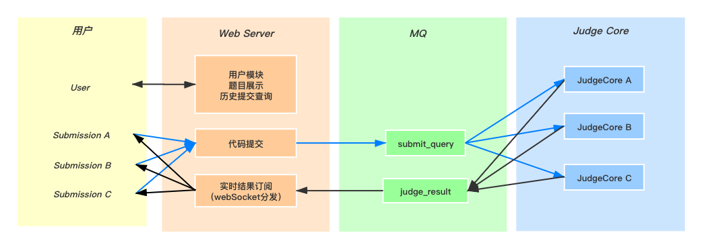
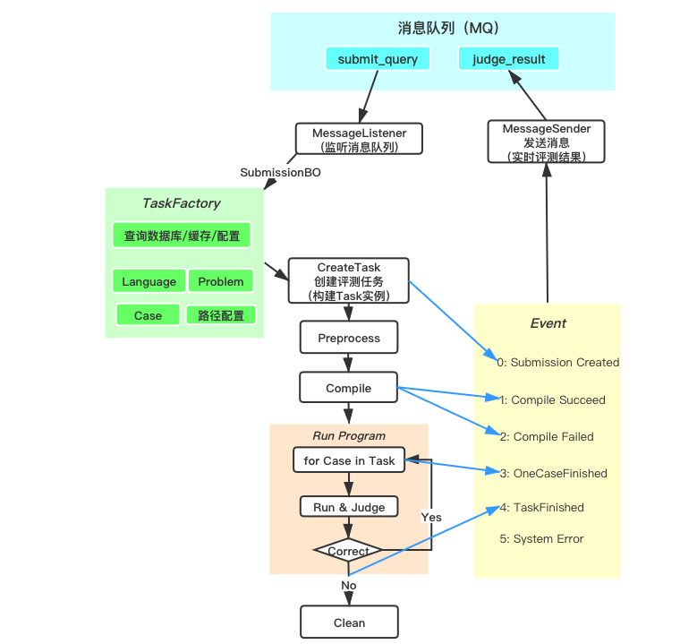

# **在线评测系统开发总结**

## **项目结构**

## **评测核心流程的实现**

### JudgeCore  

## **亮点功能**

- 可以查看实时的评测结果
- 可以查看每个Case的状态
- 可以自主选择订阅模式，选择性地看到submission
(根据submissionId、用户Id、用户组订阅)

## **问题与思考**

### **关于消息队列**

#### 1. 为什么要使用消息队列？ 
- **非阻塞**   
    当提交数较大时，测评可能出现排队状况，测评结果响应时间变长。  
    为了避免用户长时间等待导致体验下降，用户提交代码后，我们将其请求加入消息队列，而后立即返回。  
    等待测评期间用户可以切换页面、做别的事情，而无需一直等待测评结果，提高了用户体验。 

- **解耦**  
    由于 Judge Core 是由 Web Server 接到提交请求后才开始处理的，二者之间天然具有耦合关系。  
    如果不用消息队列进行解耦，那么 Web Server 会在代码里直接调用 Judge Core（测评机）相关的功能接口。  
    若后续需要增加测评机数量、在多处部署测评机，将不得不多次修改 Web Server的代码，不利于维护。(可能会部署多个JudgeCore实例)  
    后续也可能会添加其他功能，用到 Web Server 生产的数据，但不希望反复修改 Web Server 内部代码，因此尽早把 Web Server解耦也有利于后续功能的添加

#### 2. 引入消息队列，会不会带来问题？  
- 会，任何技术都是有其代价的（没有免费的午餐）
- 消息队列最终被整个系统高度依赖，一旦消息队列挂掉，这个系统都会挂掉
- 难以保证消息接收的顺序性

#### 3. 如何处理代码抛出异常时，消息不断重复消费的问题？
- 对于RabbitMQ，若接到消息后处理消息的过程中抛出异常（程序没有正常结束），默认会将此消息重新加入队列。  
  但如果代码期间并没有修改，重复运行此消息还是会报错，最终导致控制台出现“刷屏”式的异常信息，浪费系统资源。
- (暂时的粗略处理方式)：在接收消息的入口处 try catch，若出现异常：  
  对于 Judge Core：直接返回 System error 到评测结果队列即可。  
  对于 Web Server：直接丢弃消息即可。（用户并不用精确收到每个实时测评结果）
- 更好的处理方式：（待思考）
   
#### 4. 如何保证消息的顺序性？
- 展示评测结果时，希望按照事件发生顺序展示。
- 但RabbitMQ 自身似乎无法保证消息的顺序性。
- 所以在前端实现消息处理，检查所有收到的消息，只显示最新消息（EventId号更大的消息）。

### **关于WebSocket**

#### 1. 什么是WebSocket？为什么在这个项目里使用WebSocket？
- WebSocket 让我印象深刻的一点是，它可以令服务器主动向客户端发送数据。
- 项目中，用户提交代码后，服务器评测过程中会针对此Submission多次发送消息给用户  (每完成一个评测阶段，发送一个消息）
- 但事实上，用户不可能确切知道何时会收到服务器的返回消息，在评测拥挤、排队时更是这样。
- 如果采用传统的HTTP，则只能使用 **"轮巡"** 的方法：  
  由客户端主动发起询问请求，每隔一段时间请求一次，服务器若有新消息则返回新数据。但这样明显开销较大。
- 所以更好的方式是使用 **WebSocket** :   
  WebServer从消息队列里接到测评结果，就主动返回给发起这个Submission的用户  
  不仅没有轮巡的开销，还能实现多种实时订阅模式（只看本次提交/只看自己的提交/只看朋友的提交）

#### 2. 如何实现“每个用户只看到自己的提交”？（即如何实现选择性订阅）
- [WebSocket部分代码笔记](./doc/others/WebSocket.md)

#### 3. 如何处理"用户不在线"的情况？
- 若 Web Server 收到实时消息时，应接收消息的用户并不在线（已退出了结果查看页面），则直接忽略此消息（不发送并丢弃）
- Web Server 实现了判断机制：如果收到的消息是**终态**评测结果，会将其写入数据库（持久化）。
- 所以此用户一段时间后查询，可直接得到评测的**最终结果**。

### **多Case问题的两种不同评测方式**

- **单次跑完** 
- **一次跑一个Case**  
    我选择了后者，因为能看到每个Case的情况，还能看到实时的评测结果

### **Java调用C程序进行评测处理：两种方式**
- 调用命令行接口（Runtime）
- JNI

### **进程处理**
- 由于评测任务必须开启单独的进程，Java默认只有一个Runtime实例，所以目前同一时间只能有一个submission在评测

### **其他积累** 
- [参数校验（JSR）](./doc/others/JSR.md)
- 异常处理
- Controller自定义参数解析
- 跨域问题
- 对象级缓存的实现（Redis）
- Redis键的规范定义
- 枚举的定义
- maven 生命周期
- spring 的配置文件及其解析顺序
- TaskFactory的设计与"工厂模式"
- Task 与 TaskCase：自定义迭代器

## **部署**
- docker容器化
- 自动部署
